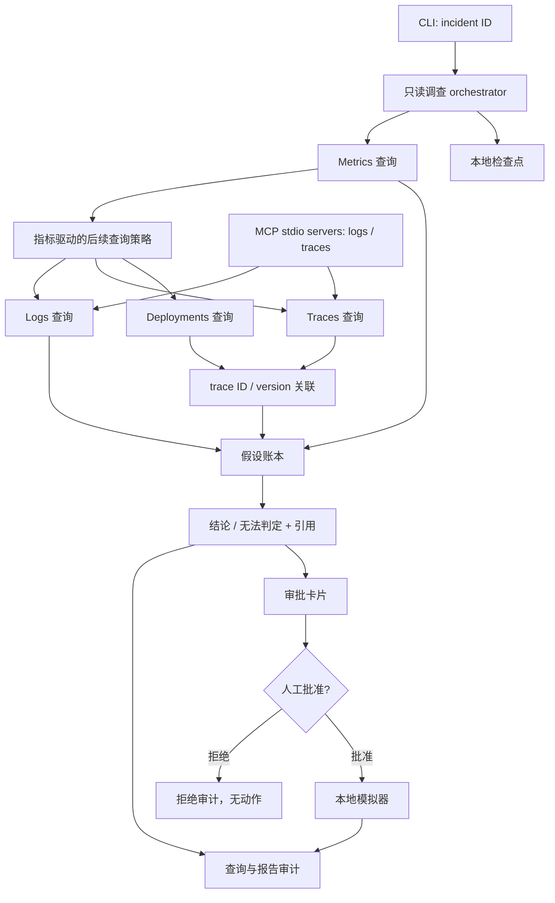

# OpsPilot 本地原型架构

```mermaid
flowchart TD
    CLI[CLI: incident ID] --> ORCH[只读调查 orchestrator]
    ORCH --> MET[Metrics 查询]
    MET --> PLAN[指标驱动的后续查询策略]
    PLAN --> LOG[Logs 查询]
    PLAN --> TRACE[Traces 查询]
    PLAN --> DEP[Deployments 查询]
    LOG --> LEDGER[假设账本]
    TRACE --> LINK[trace ID / version 关联]
    DEP --> LINK
    MET --> LEDGER
    LINK --> LEDGER
    LEDGER --> REPORT[结论 / 无法判定 + 引用]
    REPORT --> AUDIT[查询与报告审计]
    REPORT --> CARD[审批卡片]
    CARD --> APPROVE{人工批准?}
    APPROVE -->|拒绝| DENY[拒绝审计，无动作]
    APPROVE -->|批准| SIM[本地模拟器]
    SIM --> AUDIT
    ORCH --> STATE[本地检查点]
    MCP[MCP stdio servers: logs / traces] --> LOG
    MCP --> TRACE
```

检查点和审计文件只保存在本机 `var/`。MCP 服务只读本地合成数据；批准动作只进入模拟器。
